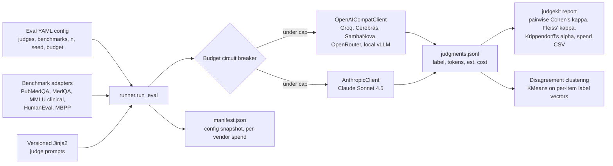

# JudgeKit

**Run one prompt set through five LLM judges from different vendors, then measure how much they agree, where they disagree, and what it cost.**

[](https://github.com/TirtheshJani/JudgeKit/actions/workflows/ci.yml)
[](LICENSE)
[](pyproject.toml)


## Why multi-judge

"LLM-as-judge" evaluations usually trust a single model's verdict. That hides two problems: a judge can be systematically biased (toward its own family's style, toward verbose answers, toward "correct"), and you have no measure of how reliable the labels are. JudgeKit treats judges the way annotation studies treat human raters: the same items go to several independent judges from different vendor families, and the output is inter-rater reliability (Cohen's kappa per pair, Fleiss' kappa and Krippendorff's alpha overall) plus clusters of the recurring disagreement patterns. Cost is a first-class output: every judgment records tokens and estimated USD, and a circuit breaker stops the run before it crosses a hard cap.

## Architecture



Design points:

- **One client class for every OpenAI-compatible vendor**, switched by base URL (`src/judgekit/clients/openai_compat.py`, `registry.py`). A thin wrapper gives the Anthropic SDK the same `Judge` interface.
- **Rate-limit-aware retry** (`retry.py`) retries 429 and 5xx responses and honours `Retry-After`.
- **Reproducible configs**: pinned model IDs, seed, dataset splits and versioned prompt templates in `configs/*.yaml`.
- **Every judgment is a JSONL record** (`run_id, benchmark_id, item_id, judge_id, label, raw_text, prompt_tokens, completion_tokens, est_cost_usd, latency_ms, error`), so analysis is decoupled from the API calls.

## The judges

| Vendor | Model | API style | Tier |
| --- | --- | --- | --- |
| Groq | `llama-3.3-70b-versatile` | OpenAI-compatible | Free |
| Cerebras | `llama-3.3-70b` | OpenAI-compatible | Free |
| SambaNova | `DeepSeek-R1` | OpenAI-compatible | Free |
| OpenRouter | `meta-llama/llama-3.3-70b-instruct:free` | OpenAI-compatible | Free |
| Anthropic | `claude-sonnet-4-5` | Anthropic SDK | Paid |
| Local vLLM (optional sixth) | `Qwen/Qwen3-8B` (AWQ INT4) | OpenAI-compatible | Your GPU |

These five are what `configs/all_five_judges.yaml` runs. The local Qwen3-8B judge is supported by the client registry (`vendor: vllm`, default `http://localhost:8000/v1`) but is not in the headline config.

## Benchmarks

| Benchmark | Hugging Face dataset | Domain |
| --- | --- | --- |
| PubMedQA | `pubmed_qa` (`pqa_labeled`) | Medical |
| MedQA-USMLE | `GBaker/MedQA-USMLE-4-options` | Medical |
| MMLU clinical | `cais/mmlu` (anatomy, clinical_knowledge, college_medicine, professional_medicine) | Medical |
| HumanEval | `openai_humaneval` | Code |
| MBPP | `mbpp` (sanitized) | Code |

The medical plus code split is deliberate: it tests whether judge agreement transfers across domains. Datasets are downloaded on first use by the `datasets` library. Check each dataset's license on its Hugging Face card before redistributing anything derived from it.

## Quickstart (no API keys needed)

```bash
git clone https://github.com/TirtheshJani/JudgeKit
cd JudgeKit
uv sync --group dev          # or: python -m venv .venv && pip install -e . && pip install --group dev  (pip >= 25.1)
```

**1. Agreement analysis on a bundled sample run.** `examples/sample_run/judgments.jsonl` is a small **synthetic** file (5 judges x 12 items) in the real record format. It exists to show the analysis layer; its numbers say nothing about the real judges.

```bash
uv run python examples/agreement_demo.py
```

```
Items x judges:      12 x 5
Fleiss kappa:        0.4383
Krippendorff alpha:  0.4477
...
Disagreement clusters: 3
  cluster 0 (n=3) e.g. humaneval-09, medqa-05, pubmedqa-01
...
```

(scikit-learn may print a `ConvergenceWarning` on this tiny fixture; it is harmless.)

**2. The report CLI on the same sample**, writing the spend + agreement CSV:

```bash
uv run judgekit report sample_run --results-dir examples --out /tmp/sample_report.csv
```

**3. Pre-flight cost estimate** for the full five-judge run. Reads the YAML only; no network calls:

```bash
uv run judgekit estimate --config configs/all_five_judges.yaml
```

```
  groq/llama-3.3-70b-versatile: 5500 calls, ~$0.0000 USD
  cerebras/llama-3.3-70b: 5500 calls, ~$0.0000 USD
  sambanova/DeepSeek-R1: 5500 calls, ~$0.0000 USD
  openrouter/meta-llama/llama-3.3-70b-instruct:free: 5500 calls, ~$0.0000 USD
  anthropic/claude-sonnet-4-5: 5500 calls, ~$22.2750 USD
```

`judgekit run --config configs/smoke_test.yaml --dry-run` prints the same kind of estimate for the 10-item smoke config.

## Full run (needs API keys)

Copy `.env.example`, fill in the keys you have, and export them (JudgeKit reads plain environment variables; it does not load `.env` files itself).

| Variable | Used by |
| --- | --- |
| `GROQ_API_KEY` | Groq judge |
| `CEREBRAS_API_KEY` | Cerebras judge |
| `SAMBANOVA_API_KEY` | SambaNova judge |
| `OPENROUTER_API_KEY` | OpenRouter judge |
| `ANTHROPIC_API_KEY` | Anthropic judge (paid) |
| `JUDGEKIT_ANTHROPIC_BUDGET_USD` | Default cap for a `BudgetTracker` created without an explicit cap (default 25.0). `judgekit run` passes `budget_usd` from the YAML explicitly, so for CLI runs the YAML value is the cap. |

```bash
# Needs GROQ_API_KEY; downloads PubMedQA; cost $0.
uv run judgekit run --config configs/smoke_test.yaml --run-id smoke
uv run judgekit report smoke --out results/smoke/report.csv

# Needs all five keys; Anthropic spend is capped at budget_usd (25.0) in the YAML.
uv run judgekit run --config configs/all_five_judges.yaml --run-id headline_v01
uv run judgekit report headline_v01 --out results/headline_v01/report.csv
```

Each run writes `results/<run_id>/judgments.jsonl` and `results/<run_id>/manifest.json` (config snapshot, judges, per-vendor spend, record and error counts, timestamps). The commands in this section were not executed while preparing this README because they need live API keys.

**Optional local judge (needs a CUDA GPU, tested target RTX 4080 16 GB):**

```bash
bash scripts/serve_qwen_vllm.sh   # vllm serve Qwen/Qwen3-8B --quantization awq --gpu-memory-utilization 0.85 --max-model-len 4096 --port 8000
```

then add `- {vendor: vllm, model: Qwen/Qwen3-8B}` to a config's `judges` list.

## Cost and budget

Anthropic `claude-sonnet-4-5` is priced in `src/judgekit/budget/pricing.py` at $3 per 1M input tokens and $15 per 1M output tokens; the free-tier vendors are priced at $0. Re-check vendor pricing before a paid run.

| Estimate for `all_five_judges.yaml` (5 benchmarks x n=1100, 5 judges) | Anthropic cost |
| --- | --- |
| `judgekit estimate` (600 input + 150 output tokens per call) | ~$22.28 |
| `scripts/estimate_budget.py` (600 input + full 256-token `max_tokens` output per call, worst case) | ~$31.02 |
| Hard cap (`budget_usd` in the YAML) | $25.00 |

Both estimates are upper bounds on call count, since some benchmarks have fewer than 1100 items (HumanEval has 164 problems). If real outputs run long, the worst case exceeds the cap; that is what `BudgetCircuitBreaker` is for. Before each call it adds the estimated cost (prompt tokens plus `max_tokens` of output) to the running total and raises `BudgetExceededError` if that would cross the cap, so the run stops instead of overspending.

## Results

**Pending.** The headline five-judge run (`headline_v01`) has not been executed yet, so there are no real agreement or spend numbers to report. When it runs, `judgekit report` produces the pairwise kappa matrix, Fleiss' kappa, Krippendorff's alpha and per-vendor spend, and the tech note in `paper/` will be filled from that CSV. The only numbers in this README come from the synthetic sample and the cost estimator.

## Development

These are the exact checks CI runs (`.github/workflows/ci.yml`, Python 3.11, no API keys):

```bash
uv sync --group dev
uv run ruff check .
uv run ruff format --check .
uv run mypy src/judgekit
uv run pytest --tb=short
```

The test suite mocks all HTTP traffic (`pytest-httpx`, `respx`), so it runs fully offline. See [CONTRIBUTING.md](CONTRIBUTING.md).

## Repository layout

```
src/judgekit/
  cli.py              judgekit run | estimate | report
  config.py           pydantic models for the eval YAML
  runner.py           orchestrates a run, writes JSONL + manifest
  manifest.py         run manifest schema
  retry.py            rate-limit-aware retry decorator
  clients/            OpenAI-compatible client, Anthropic wrapper, vendor registry
  benchmarks/         PubMedQA, MedQA, MMLU clinical, HumanEval, MBPP adapters
  prompts/            versioned Jinja2 judge templates
  agreement/          Cohen's kappa, Fleiss' kappa, Krippendorff's alpha, disagreement clustering
  budget/             pricing table, spend tracker, circuit breaker, pre-flight estimator
configs/              smoke_test, per-domain and all_five_judges eval configs
examples/             offline agreement demo + synthetic sample run
scripts/              vLLM launch script, standalone budget estimator
paper/                LaTeX tech-note skeleton (numbers pending headline run)
tests/                pytest suite (offline, HTTP mocked)
docs/plans/           per-phase implementation plans
```

## Limitations

- **No headline results yet** (see Results).
- **What is being judged.** Candidate answers currently come from the datasets themselves: PubMedQA uses the long answer and MedQA the gold answer text; MMLU clinical, HumanEval and MBPP have no candidate-generation step yet, so the judge prompt receives an empty candidate. Agreement on these items measures judge behaviour on that input, not answer quality. Adding a candidate-model step is the main open item.
- **Labels are coarse**: `CORRECT`, `INCORRECT`, `UNCERTAIN`, with `ERROR`/`UNPARSABLE` for failed or malformed calls, parsed from the last line of the judge output.
- **Cost estimates are approximate**: fixed 600-token prompts in the estimator and a chars/4 heuristic in the runner's breaker. Actual cost is computed from vendor-reported token counts.
- **Free tiers change.** Free-tier model IDs and rate limits for Groq, Cerebras, SambaNova and OpenRouter can change without notice.
- **PyPI.** The name `judgekit` is already used on PyPI by an unrelated project, so `pip install judgekit` does **not** install this package. Install from source until a distinct distribution name is chosen.

## License

MIT, see [LICENSE](LICENSE). Citation metadata is in [CITATION.cff](CITATION.cff).

## Author

Tirthesh Jani
